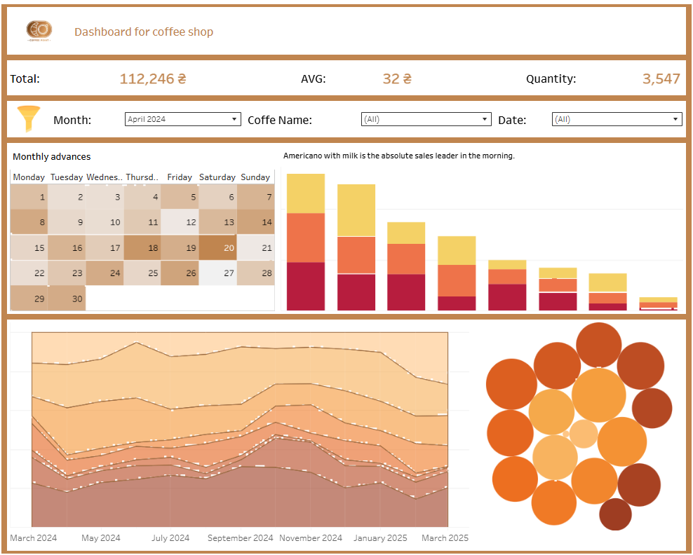

# ☕ Coffee Sales Dashboard
## Tools: BigQuery, SQL, Tableau Public
**Goal**: Visualization of coffee buyer behavior patterns based on a transactional dataset

This dashboard shows key coffee sales metrics for the period March 2024 – March 2025, including:

  :pushpin: Total revenue (112,246 ₴), average check (32 ₴), and number of transactions (3,547)
  
  :pushpin: Sales trends by month, day of the week, time of day, and coffee type
  
  :pushpin: The most popular types of coffee depending on the time of day and weekends
  
  :pushpin: Interactive filters for deeper analysis: month, coffee type, date
  
## 🔍 SQL logic that I implemented:

<details>
<summary>Aggregation of financial indicators:</summary>

```bash
SELECT 
 ROUND(SUM(money),2) AS total_revenue,
 ROUND(AVG(money),2) AS avg_revenue,
COUNT(money) AS total_transactions
  FROM `graphical-tape-436606-c6.art_house_coffe.art_coffe`;
```
</details>

<details>
<summary>Coffee ranking by revenue:</summary>

  ```bash
SELECT coffee_name,
 ROUND(SUM(money),2) AS total_revenue,
 ROUND(AVG(money),2) AS avg_revenue,
COUNT(money) AS total_transactions
  FROM `graphical-tape-436606-c6.art_house_coffe.art_coffe`
 GROUP BY coffee_name
 ORDER BY total_revenue DESC;
```
</details>

<details>
<summary>Determining the most active sales period:</summary>

  ```bash
WITH top_hour_of_day as (
 SELECT 'Hour of Day' as name_of_indicator, hour_of_day, COUNT(*) as total_transactions
 FROM `graphical-tape-436606-c6.art_house_coffe.art_coffe`
 GROUP BY hour_of_day
 ORDER BY total_transactions DESC
 LIMIT 1), top_time_of_Day as (
  SELECT 'Time of Day', Time_of_Day, COUNT(*) as total_transactions
  FROM `graphical-tape-436606-c6.art_house_coffe.art_coffe`
  GROUP BY Time_of_Day
  ORDER BY total_transactions DESC
 LIMIT 1), top_weekday as(
 SELECT 'Weekday', Weekday, COUNT(*) as total_transactions
  FROM `graphical-tape-436606-c6.art_house_coffe.art_coffe`
  GROUP BY Weekday
  ORDER BY total_transactions DESC
 LIMIT 1),	top_month_name as (
  SELECT 'Month Name', Month_name, COUNT(*) as total_transactions
  FROM `graphical-tape-436606-c6.art_house_coffe.art_coffe`
  GROUP BY Month_name
  ORDER BY total_transactions DESC
 LIMIT 1)
SELECT name_of_indicator, hour_of_day as top_indicators, total_transactions FROM top_hour_of_day
UNION ALL
SELECT * FROM top_time_of_Day
UNION ALL
SELECT * FROM top_weekday
UNION ALL
SELECT * FROM top_month_name;
```
</details>


[Dashboard for coffe shop (Free Data Source)](https://public.tableau.com/app/profile/maksym.herasymov/viz/DashboardforcoffeshopFreeDataSource/One-yearreport?publish=yes)


## 🎨 Visual components:

**Bar chart:** popularity of coffee by sales volume

**Area chart:** sales dynamics by month

**Bubble chart:** distribution of coffee consumption by time of day

**Activity calendar:** color coding by day

This project demonstrates my skills in SQL analytics, visual storytelling, dashboard branding, and user experience optimization. It is part of my portfolio as a data analyst focused on business insights and UX.

